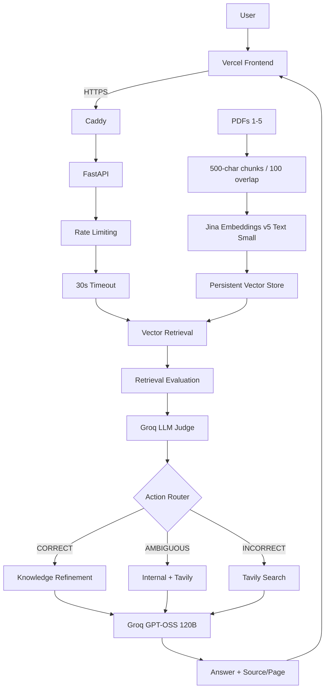

# CorrectRAG

A corrective RAG system that evaluates retrieved evidence, chooses a corrective action, and uses web search when internal knowledge is insufficient.

Live Demo: https://frontend-cyan-seven-41.vercel.app/

API Health: https://13.235.51.127.sslip.io/health

## How It Works

Traditional RAG:

```text
Query → Retrieve → Generate
```

CorrectRAG adds retrieval evaluation:

```text
Query
  ↓
Retrieve
  ↓
Evaluate Evidence
  ↓
┌────────────┬────────────┬────────────┐
│  CORRECT   │ AMBIGUOUS  │ INCORRECT  │
│  Refine    │ Internal + │ Web Search │
│  Evidence  │ Web        │            │
└────────────┴────────────┴────────────┘
  ↓
Grounded Answer
```

## Architecture



## Key Features

* Corrective routing (CORRECT / AMBIGUOUS / INCORRECT)
* Multi-PDF knowledge base
* Maximum 5 PDFs, 25 MB each
* Source and page provenance
* Retrieval quality evaluation
* Knowledge refinement
* Tavily web fallback
* Jina 1024-dimensional embeddings
* Groq GPT-OSS 120B
* 10 requests/minute per IP
* 30-second request timeout
* HTTPS with Caddy
* Docker + AWS EC2 deployment

## Tech Stack

```text
Frontend:  HTML, CSS, JavaScript, Vercel
Backend:   Python, FastAPI, Pydantic
RAG:       Jina Embeddings, Vector Store, Cosine Similarity
LLM:       Groq GPT-OSS 120B
Search:    Tavily
Deploy:    Docker, EC2 t4g.micro, Caddy, HTTPS
```

## Project Structure

```text
correctrag/
├── backend/app/
│   ├── api/
│   ├── evaluation/
│   ├── ingestion/
│   ├── pipeline/
│   └── retrieval/
├── frontend/
├── tests/
├── scripts/
├── evaluation/
├── CRAG.pdf
├── README.md
└── CLAUDE.md
```

## Setup

```bash
git clone https://github.com/vivz-git/correctrag.git
cd correctrag

python -m venv .venv
pip install -r backend/requirements.txt

uvicorn app.main:app --app-dir backend --reload
```

Environment variables:

```env
JINA_API_KEY=your_jina_api_key
GROQ_API_KEY=your_groq_api_key
TAVILY_API_KEY=your_tavily_api_key
```

Never commit `.env` or API keys.

## Re-indexing

```bash
python scripts/reindex_corpus.py
```

Current corpus:

```text
168 chunks
1024-dimensional embeddings
```

## Testing

```bash
pytest -q tests
```

360 tests cover ingestion, indexing, retrieval, refinement, CRAG routing, API behavior, rate limiting, timeouts, and regressions.

## Resume-Ready Description

Built CorrectRAG, a corrective retrieval-augmented generation service (FastAPI + Gemini/Jina embeddings + Groq LLM judge) that scores retrieved evidence before generation, routes low-confidence queries to Tavily web search, and enforces multi-document source/page provenance, per-IP rate limiting, and request timeouts; deployed on AWS EC2 behind Caddy/HTTPS with a Vercel frontend, backed by 360 automated tests.

## Engineering Highlights

* Evidence-aware retrieval instead of blindly trusting search results
* Corrective routing between internal knowledge and web search
* Multi-document provenance
* Lightweight deployment without Redis, RDS, ECS, or a dedicated vector database
* Explicit and testable CRAG pipeline

## Limitations

Designed for portfolio/demo use.

* 5 PDF limit
* 25 MB per PDF
* Single vector store
* In-memory rate limiting
* No authentication or multi-tenancy
